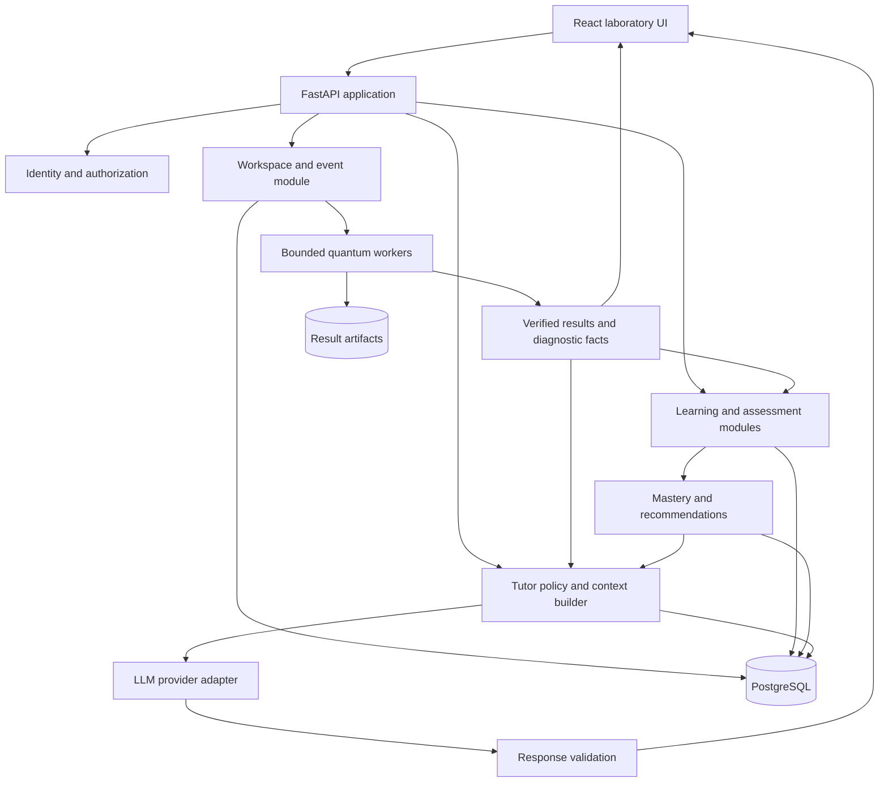

# Quantum Learning Laboratory — Product and Engineering Blueprint

Version 1.0 · 10 September 2026 · Architecture only; no implementation

## 1. Product decision and operating principles

Build an interactive quantum laboratory where a student predicts an outcome, changes a circuit, observes a verified result, explains what happened, and receives targeted teaching. Lessons organize this loop; the circuit and its evolving state are the center of the experience.

The initial audience is motivated beginners with basic algebra, including undergraduate students and software developers. Programming and prior quantum mechanics are not prerequisites. Offer optional mathematical depth within lessons and a short prerequisite bridge for complex numbers, vectors, and probability. Start with individual learners, English content, and desktop/tablet use; institutional administration and mobile circuit authoring are later extensions.

**Architectural rule:** the quantum engine calculates the state under an explicitly selected model; visualizations display that state; the AI explains it. An ideal simulator represents a mathematical model, not every property of physical hardware.

**Learning rule:** meaningful student actions become structured evidence. Exploration is not automatically a mistake, activity is not automatically mastery, and asking for help is not misconduct.

**Recommended starting architecture:** React/TypeScript frontend, Python/FastAPI modular backend, a versioned educational quantum-engine facade over Qiskit, PostgreSQL, and an LLM accessed only through backend orchestration. Begin with one backend codebase and separately bounded simulation workers. Avoid a custom general-purpose simulator, autonomous tutor agents, and a microservice fleet in the MVP.

Success means a learner can independently transfer a concept to a new circuit and explain its behavior. Completion rate and engagement are supporting measures, not the definition of learning.

## 2. User journey and learning loop

1. **Orient:** choose prior experience and a learning goal; optionally answer a diagnostic. Show a small manipulable qubit immediately.
2. **Predict:** answer a short question before running an experiment. Preserve the prediction as evidence.
3. **Experiment:** add a gate or change a parameter; the engine produces a new verified state.
4. **Observe:** synchronized circuit, probabilities, amplitudes, and timeline make the change visible.
5. **Explain:** the student selects or writes a reason. The tutor links its response to the selected run and step.
6. **Practice:** complete a scaffolded exercise with progressively stronger hints available on request.
7. **Transfer:** solve a goal-based challenge with a different initial state or representation.
8. **Assess:** pass an unassisted lesson test; receive concept-specific feedback and a revision route.
9. **Continue:** unlock the next lesson; retain permanent access to completed content and previous attempts.
10. **Return:** resume the saved workspace and receive a small amount of scheduled revision based on prior evidence.

Keep three modes explicit: **Explore** permits unrestricted experimentation within resource limits; **Practice** offers feedback and hints; **Test** follows published assessment rules. A learner can leave a test to practice, but that assessment attempt is then marked assisted/abandoned rather than silently treated as unassisted.

A typical lesson uses short concept cards, one prediction, one experiment, two guided tasks, a challenge, a mini quiz, and a final test. Exact counts vary with the objective; every lesson has each activity category requested in the brief.

## 3. Curriculum architecture

Represent curriculum as a prerequisite directed acyclic graph, with a suggested route through it. Lessons contain activities; concepts and skills cross lesson boundaries. Separate a concept such as relative phase from skills such as predicting the effect of Z or explaining interference.

| Stage | Modules and prerequisites | Demonstration of learning |
|---|---|---|
| Optional bridge | Probability, complex numbers, vectors, normalization; matrices introduced when needed | Convert amplitudes to probabilities and check normalization |
| Foundations A | Computational basis; amplitudes; measurement and repeated trials | Distinguish an exact probability from a sampled frequency |
| Foundations B | X, H, Z; superposition; relative versus global phase; interference | Explain why H followed by H returns the input state |
| Foundations C | Bloch sphere; rotations; measurement bases | Distinguish states with identical Z-basis probabilities |
| Foundations D | Tensor products; multiple qubits; circuit ordering; controlled gates | Predict basis-state behavior and construct a Bell state |
| Foundations E | Entanglement, reduced states, correlations, mixed-state introduction | Explain why local 50/50 outcomes do not establish entanglement |
| Algorithm bridge | Reversible computation, oracles, phase kickback, query versus gate cost | Explain a controlled operation and its phase effect |
| Introductory algorithms | Deutsch, Deutsch–Jozsa, Bernstein–Vazirani | Identify each promise, output, and classical comparison model |
| Search branch | Grover, then generalized amplitude amplification | Predict amplification and the effect of excessive iterations |
| Periodicity branch | Simon, with binary linear algebra support | Reconstruct a hidden string from independent sampled constraints |
| Fourier branch | QFT, then QPE; requires phase and controlled powers | Relate phase to measurement precision and explain inverse QFT |
| Advanced algorithms | Shor after modular arithmetic, QFT/QPE, and classical postprocessing | Trace order-finding and explain when factoring must retry |
| Noise and protection | Channels, density matrices, simple repetition codes, stabilizers, quantum error correction | Decode syndromes without claiming a bit-flip code corrects all errors |
| Fault-tolerant branch | Surface-code concepts, logical errors, fault tolerance, resource overhead | Separate physical qubits, logical qubits, and logical operations |
| Variational branch | Observables, expectation values, classical optimization; VQE and QAOA | Inspect an objective landscape and separate heuristic results from guarantees |
| Extensions | Quantum walks, Hamiltonian simulation, amplitude estimation, complexity | Explain assumptions and identify an appropriate application |

Superposition belongs with the first gates, not as an isolated module after students already use it. Introduce interference before algorithms. Introduce tensor products before entanglement. Simon is pedagogically harder than Deutsch/Bernstein–Vazirani, so it is an optional bridge to periodicity rather than an early compulsory hurdle. Grover is a major algorithm; Shor is advanced. Quantum error correction is a substantial branch, not a short closing lesson.

Each concept has prerequisite edges, misconception tags, examples, counterexamples, mathematical depth, and a version. Each skill has observable success criteria. For example, `phase.distinguish_relative` and `measurement.predict_z` are separate skills even when tested using the same qubit.

**Unlock policy:** required activities must be complete, the lesson test must score at least 80%, and designated essential skills must have successful unassisted evidence. Treat 80% as an initial product rule to validate, not an empirically established threshold. Retakes use equivalent forms. Weak performance generates targeted revision, not an endless repeat of the full lesson. Later add a diagnostic challenge-out route. Mastery decay never re-locks completed lessons.

## 4. Feature and content architecture

| Capability | Owning module | Contract with other modules |
|---|---|---|
| Lesson sequencing and unlocks | Learning | Reads published content and evaluated evidence; issues access decisions |
| Circuit authoring and replay | Workspace | Owns immutable revisions, edit events, execution requests, and selected view |
| State calculation | Quantum engine | Accepts validated circuit IR; returns versioned results and facts |
| Exercise correctness | Assessment | Applies an authored rubric to authoritative engine results and answers |
| Misconception detection | Diagnostics | Emits evidence-backed observations and tentative interpretations |
| Hint progression | Tutoring policy | Controls maximum disclosure and records what was actually delivered |
| AI explanation | Tutor orchestration | Reads authorized context and verified facts; cannot write grades |
| Mastery and recommendations | Learner model | Aggregates evidence into estimates and suggested next activities |
| Charts and animation | Presentation | Consumes immutable view data; never decides correctness |

Author lessons in a schema-validated, Git-reviewed content package for the MVP. Use an allowlisted block vocabulary: explanation, formula, prediction, visualization, experiment, guided task, challenge, quiz, assessment, reflection. Rich text is data, not executable code.

An exercise definition includes its version, skill tags and weights, initial circuit, allowed operations, variable ranges, evaluator type, checkpoints if applicable, hint ladder, completion rule, solution visibility, common misconceptions, and reference fixtures. Public content and private rubrics are separate payloads. References are examples of valid solutions; they are not automatically the only accepted circuits.

Publishing requires schema validation, successful reference solutions, adversarial wrong solutions, quantum-educator review, and accessibility review. Pin an attempt to its original content version. A corrected rubric triggers an explicit regrade with an audit record; it must not rewrite history invisibly.

## 5. Complete system architecture

The backend is a modular monolith with explicit boundaries and one transactional database. Simulation executes in a bounded process pool or worker deployment, not inside an async request loop. FastAPI supports multiple application workers, but CPU-heavy simulation still needs its own concurrency and resource policy. [FastAPI deployment documentation](https://fastapi.tiangolo.com/deployment/server-workers/)

Use HTTPS/JSON for commands and reads. Use server-sent events (SSE) for run status and tutor responses; polling is the fallback. WebSockets become useful for future collaborative circuit editing, not a prerequisite for single-user labs.

Persist domain events and materialized read models, rather than event-sourcing every table. A PostgreSQL transactional outbox makes assessment-to-mastery processing durable. Queue delivery is at least once; consumers use unique evidence IDs to make effects idempotent.

Start with a static frontend deployment, API container, bounded simulation workers, managed PostgreSQL, and private object storage when needed. Redis is optional until shared caching, queue throughput, or distributed rate limits justify it. No Kubernetes requirement for the MVP.

## 6. Frontend architecture

Use React with TypeScript and a conventional Vite build for the application. A future public marketing/content site can use a server-rendered framework independently. The laboratory benefits primarily from interactive client state, not server rendering.

Organize by feature: learning shell, circuit workspace, result inspector, playback, assessments, tutor, and learner dashboard. Share typed API contracts, a design system, math rendering, and accessible chart primitives.

Maintain four distinct state categories:

- **Server state:** lessons, saved revisions, runs, grades, mastery; use a query/cache layer such as TanStack Query.
- **Draft state:** gate edits, parameter values, selection, unsaved commands; use a small external store such as Zustand or a reducer.
- **Presentation state:** open panels, camera angle, timeline cursor, playback speed. These never alter a quantum result.
- **Verified result state:** immutable data keyed by run ID, circuit revision, execution step, branch, and engine version.

All panels subscribe to one selected-result identity. An old response cannot overwrite a newer result. Editing a parameter cancels or supersedes pending requests, then debounces another run. The UI may optimistically show the circuit edit, but probabilities remain marked pending until a matching verified result arrives.

Prefer an SVG circuit editor with explicit rows, columns, gate IDs, and keyboard operations. Quantum circuits have wire and ordering semantics that a generic node graph often obscures. Add drag-and-drop as a convenience alongside buttons and keyboard placement. Represent logical circuit order separately from visual placement.

Keep rendering and expensive transformations off the main interaction path; use a Web Worker for large view transformations if profiling supports it. Do not introduce a second browser physics implementation in the MVP. Later, a tested WASM/browser engine may produce clearly labeled previews; server verification remains required for assessment.

Suggested future repository boundaries: `apps/web`, `apps/api`, `packages/contracts`, `packages/content`, `packages/quantum`, and `tests/fixtures`. This is a proposed organization, not implementation created by this document.

## 7. Backend architecture and consistency

Backend modules expose application services rather than reading each other's private tables arbitrarily. The API validates ownership, published-version access, quotas, parameter types, and mode permissions before dispatching work.

**Circuit edit transaction:** check `base_revision`; append accepted edit events; produce an immutable circuit revision; advance the workspace head; commit. Return a conflict when another tab changed the base. Offer reload or an explicit branch; never silently merge incompatible gate operations.

**Execution lifecycle:** queued → running → completed, failed, or cancelled. A run references a fixed revision. Only a completed, validated run is eligible for assessment. Cancellation is best effort; superseded results may finish but cannot become the selected current result.

**Assessment transaction:** freeze the submitted revision and answer; verify or run it; apply the versioned rubric; persist the evaluation, evidence, and outbox event together. A background consumer updates mastery and lesson access. For small MVP submissions, update those projections in the same transaction; retain the outbox for notifications and later asynchronous processing. Do not report an unlock before the access record exists.

Tutor completion is outside the grading transaction. A model outage cannot prevent saving work, deterministic grading, or lesson completion. Authored explanations and hint cards provide the fallback.

Use database migrations, OpenAPI-derived client types, structured error codes, and correlation IDs. Keep evaluator and engine versions available for replay and audit.

## 8. Quantum simulation architecture

### Engine choice

Adopt a **hybrid architecture: build the educational interface and instrumentation; reuse established numerical implementations**.

| Option | Strength | Cost or limitation | Decision |
|---|---|---|---|
| NumPy-only custom engine | Transparent, easy to explain basic linear algebra | You own ordering, controlled operations, measurement, noise, numerical behavior, and verification | Use for independent small reference fixtures and math demonstrations; not the sole production authority |
| Qiskit with Aer | Circuit ecosystem and several simulation methods | Educational step semantics and provider independence still require a wrapper | Primary engine backend |
| Cirq | Explicit qubit ordering and useful simulation interfaces | A second production adapter adds maintenance without immediate learner value | Strong alternative; selected cross-checks where useful |
| PennyLane | Differentiable quantum/classical workflows | Its optimization focus is unnecessary for the initial lessons | Reconsider for VQE/QAOA modules |

Aer provides statevector, density-matrix, stabilizer, and other simulation methods. Choose methods explicitly and expose their capabilities; do not present all results as interchangeable. Cirq makes qubit ordering an explicit concern. PennyLane supports differentiation workflows valuable for variational lessons. [Aer simulation methods](https://qiskit.github.io/qiskit-aer/tutorials/1_aersimulator.html), [Cirq simulation](https://quantumai.google/cirq/simulate/simulation), [PennyLane gradients](https://docs.pennylane.ai/en/stable/introduction/interfaces.html)

For the MVP, use Qiskit statevector operations for instrumented ideal evolution and a controlled measurement routine through the engine facade; use Aer for repeated-shot execution where appropriate. The facade owns input validation, provenance, state extraction, and the educational result contract. It must not accept numerical answers supplied by an LLM.

### Canonical circuit intermediate representation

Define a versioned, provider-neutral circuit IR with:

- Circuit ID/revision, schema version, qubit count, classical-bit count, initial-state specification.
- Stable operation ID, operation type, ordered targets, explicit controls, parameters in radians, and classical destination for measurement.
- Ordered operations and optional pedagogical block IDs; visual row/column positions are separate metadata.
- Later capability-gated fields for reset, classical conditions, noise models, and custom reviewed subroutines.

Use `q0` as the least significant bit; display basis strings as `|q[n−1] ... q0⟩`, with q0 at the top circuit wire. Persist this convention and show labels in the UI. Convert explicitly in adapters. This matches the relevant Qiskit conventions and avoids silent reversed outcomes. [IBM bit-ordering guide](https://quantum.cloud.ibm.com/docs/en/guides/bit-ordering)

Do not store complex numbers as strings. Use real/imaginary pairs in small JSON responses and complex128 binary arrays for artifacts. Canonicalize operation names and parameter representation before hashing; never derive equivalence from a circuit hash.

### Execution modes and result contract

| Mode | Meaning | Required output |
|---|---|---|
| Ideal evolution | State evolution through unitary operations | State snapshots, probabilities, observables |
| Single trajectory | One run including sampled measurements and conditional state changes | Measurement outcomes, pre/post states, branch record |
| Shots | Repeated preparation and execution | Counts, shot total, empirical frequencies, uncertainty metadata |
| Density matrix, later | Noise or unconditioned mixed-state evolution | Density matrix or summaries, purity, probabilities |
| Hardware, later | A provider executes a compiled circuit | Measured results and hardware provenance; no invented statevector |

Every result includes `run_id`, revision/hash, execution mode, engine/build version, seed and PRNG metadata when applicable, step/branch identifiers, ordering, precision, validation status, and completeness. A state frame includes its source operation, state representation, exact probabilities where available, selected marginal states, measurements, and diagnostic facts.

Keep three objects distinct: the state immediately before measurement, the conditional post-measurement state for a recorded outcome, and the ensemble of many independently prepared shots. A repeated shot restarts preparation. Re-measuring a collapsed trajectory is a different experiment.

### Numerical rules

For normalized pure states, calculate probabilities as squared amplitude magnitudes. Apply gates through tensor/index operations rather than constructing a dense full-system unitary for each gate. Validate target ranges, control/target disjointness, parameter finiteness, and initial-state dimension/normalization.

For ideal MVP exercises, use float64/complex128 with default normalization tolerance `1e−10` and pure-state acceptance `1 − fidelity ≤ 1e−8`; these are proposed defaults to benchmark against circuit depth. Content may request a looser scientifically justified tolerance. Never conceal invalid evolution by arbitrary renormalization: distinguish small numerical drift from a failed invariant.

Calculate reduced density matrices for subsystem Bloch views. An entangled subsystem generally has a mixed reduced state and a Bloch vector inside the sphere. A set of single-qubit Bloch spheres does not encode the full joint state.

### Scope and limits

MVP: one or two qubits; X, H, Z, CNOT, computational-basis measurement; at most 100 operations and 1,024 shots per run. Keep parameterized rotations for the next foundation increment. Qubit-count changes create a new circuit revision and require a declared reset/rebuild policy; never silently discard an entangled qubit.

Later ideal interactive mode may support 8–12 qubits after profiling. Complex128 state storage alone is `16 × 2^n` bytes: 12 qubits ≈64 KiB, 20 ≈16 MiB, 24 ≈256 MiB, 30 ≈16 GiB. Density matrices require `16 × 4^n` bytes: 12 qubits already ≈256 MiB before overhead. History multiplies these costs.

Reject oversized work before allocation. Add execution deadlines, shot caps, memory caps, and per-user concurrency limits. Use small exact examples plus analytical scaling views for large problem sizes. Large surface-code lessons should use appropriate stabilizer/decoder models rather than dense statevectors.

## 9. Action history, state history, replay, and branching

Distinguish **editing history** from **execution history**. Adding H and then inserting X earlier in a circuit is an edit sequence; executing the final circuit has a different gate sequence. The tutor must never conflate them.

An accepted action event contains: event ID; actor; session; workspace; attempt when applicable; branch; client action ID; server sequence; client and server timestamps; base/result revision; event type; validated payload; schema version. Workspace events use a workspace sequence; exercise-attempt events also carry their attempt association. The server sequence establishes order. Client timestamps help study interaction timing but are not authoritative.

Meaningful events include gate insert/delete/move, parameter commit, circuit reset, prediction submitted, run requested, measurement executed, step inspected, hint delivered, answer submitted, and branch created. Record semantic parameter commits, not every pointer movement or animation frame. Derive active time from visible/active sessions with idle exclusion; never treat elapsed time as direct proof of ability.

A run-step record includes run ID, execution index, operation ID, previous step, pre/post snapshot references, branch probability when applicable, measurement outcome, and diagnostics. Simulation snapshots can be reconstructed from the initial state, pinned engine, circuit, and recorded outcomes. Store the outcomes and relevant snapshots, not only a seed: engine upgrades can change random-number behavior.

**Replay:** selecting an earlier step loads its recorded result. It never performs an inverse measurement. Forward replay follows the same recorded trajectory. **Rerun** creates a new run and optionally new random outcomes. **Edit from here** creates a branch and revision, preserving the prior future. **Undo an edit** is a new compensating edit/branch operation, not deletion of the audit trail.

For a trajectory reconstructed using recorded outcomes, verify each outcome remains possible under that pinned circuit. If a user edits the prefix, later recorded outcomes are invalidated; request a new run.

Storage policy: retain semantic events and compact circuit revisions as the canonical attempt record; retain all tiny MVP snapshots initially. Later checkpoint every 10–20 operations and at measurements, with on-demand recomputation between checkpoints. Save full vectors only where necessary; keep summaries for routine timeline rendering.

Illustrative capacity estimate: 100,000 attempts/month ×100 events ×1 KiB is about 10 GB/month before indexes and replication. The same number of attempts with 100 full 12-qubit snapshots is about 640 GB/month before overhead. This is why a full-state-per-action storage policy must not scale unchanged. Final assessed results and provenance outlive disposable simulation caches.

## 10. Exercise evaluation and mistake detection

Evaluation is a deterministic service driven by published rubric types. The LLM can explain a result but cannot replace it.

| Rubric type | Comparison | Important boundary |
|---|---|---|
| Prepare a pure state | `F = |⟨target|actual⟩|²` | Accept global-phase-equivalent states |
| Produce a distribution | Total variation distance `½Σ|p−q|` | Same probabilities do not imply the same state |
| Demonstrate observable behavior | Specified expectation values or basis measurements | Test sufficient observables for the claimed property |
| Implement an operation | Small-system unitary/process comparison, or a validated sufficient test suite | One successful input does not establish gate equivalence |
| Follow a guided procedure | Authored checkpoint predicates | Alternative paths require an explicit equivalence policy |
| Sample outcomes | Statistical acceptance policy or verified underlying probabilities | Never demand exactly 50/50 from finite shots |
| Explain a concept | Authored rubric and answer patterns; optional LLM feedback | Ambiguous free text should not block MVP progression |

For noisy states later, use an appropriate density-matrix metric rather than applying pure-state fidelity to mixed states. If a goal concerns only one subsystem, compare the relevant reduced state; do not accidentally require unrelated ancillas to match unless the task explicitly requires clean ancillas.

Separate **correctness**, **resource efficiency**, and **explanation quality**. H followed by H may be redundant in a state-preparation challenge but essential in an interference experiment. Gate-count penalties apply only to explicitly labeled optimization tasks.

Early detection has three confidence levels:

1. **Invalid operation:** unsupported gate, invalid target, impossible parameter. Block and explain immediately.
2. **Verified mismatch:** an authored checkpoint or a submitted final goal fails. Explain the exact failed property.
3. **Possible misconception:** a recurring pattern suggests confusion. Ask a diagnostic question before treating it as established.

For free construction tasks, a partial circuit is usually incomplete, not wrong. Do not highlight the first difference from a single reference solution as an error. First-divergence highlighting is valid only against a declared checkpoint sequence or invariant. If an alternative valid sequence cannot be aligned, show goal status and relevant evidence rather than fabricated step-by-step failures.

Example: a guided Bell-state lesson expects H(q0), then CNOT(q0→q1). Under the declared basis order, inserting X(q1) after H changes support from `|00⟩,|01⟩` to `|10⟩,|11⟩`. The final CNOT produces the other Bell state with support on `|01⟩,|10⟩`. It fails a specific `Φ+` target but remains a valid entangled state. The feedback should say which target property differs, not that X destroyed entanglement.

A diagnostic record contains rule/version, observation, affected skill, evidence step IDs, expected property, actual property, severity, and misconception hypothesis/confidence. Student-profile misconception counts use repeated independent evidence, not every frame of one failed run.

## 11. AI teacher architecture

Use a bounded tutor workflow with read-only domain tools, structured output, and a server-controlled teaching policy. Select a model through an evaluation suite for explanation quality, tool reliability, disclosure control, latency, and cost. Keep the provider/model behind an adapter; do not tie the domain schema to one vendor.

### Context construction

For each request, the backend builds a context envelope containing:

- Lesson/activity/content version and learning objective.
- Attempt mode, selected revision/run/step/branch, and current versus inspected-history status.
- Verified numerical facts, gate meanings, goal evaluation, and relevant checkpoint comparisons.
- Recent semantic actions and a compressed attempt summary, with tools available to retrieve older evidence.
- Relevant skill estimates, evidence count, confidence, repeated misconceptions, and prior interventions.
- Current hint allowance, already delivered hints, reading level, and approved lesson passages.

The full action history is retrievable; it is not inserted into every prompt. Include compact summaries and the relevant interval first. Never include hidden assessment answers in test-mode tutor context. Names, email addresses, and unrelated learner information are unnecessary.

### Tool interface

| Tool | Input | Result and restriction |
|---|---|---|
| `inspect_run_step` | Authorized run and step | Verified state facts and provenance |
| `get_attempt_events` | Attempt and bounded sequence range | Semantic actions; ownership enforced |
| `get_goal_evaluation` | Submitted revision/evaluation | Deterministic rubric outcomes |
| `get_skill_evidence` | Relevant skill IDs | Scoped learner history |
| `retrieve_lesson_passages` | Concept IDs/query | Approved, versioned educational material |
| `simulate_proposal` | Allowlisted temporary IR and expected base revision | Sandboxed hypothetical result; cannot modify student work |

Cap tool calls, tokens, execution time, and circuit size. A hypothetical example is marked as such. If a proposed circuit patch is offered, validate and simulate it first, then require an explicit learner click to apply it to a new revision. The tutor has no grade, mastery, unlock, or unrestricted-code execution tool.

### Output and grounding

The response schema carries intent, explanation blocks, cited fact IDs, referenced step IDs, optional Socratic question, delivered hint level, and suggested UI focus. Server validation verifies IDs, permissions, revision freshness, and allowed disclosure.

Render state-specific numerical claims from engine-backed fact cards or typed references. For example, show the verified probability value beside the model's explanation instead of relying on a number invented in prose. Require factual claims about the current circuit to reference supplied evidence. Schema checks alone cannot prove that every natural-language statement is true; constrain templates for critical feedback, add automated consistency checks for supported claims, and evaluate remaining explanation quality with expert review.

If the learner edits the circuit while the model is responding, attach the response to its original revision and label it historical. Do not present it as feedback on the new circuit. Buffer and validate structured state-dependent content before display; stream progress indicators or validated blocks, not unchecked quantum claims.

The tutor may grade low-stakes free-text practice using an authored rubric and return uncertainty. MVP final tests use deterministic item types. Later high-impact free-text assessment requires a validated scoring procedure and an appeal/review route.

Practice generation starts with approved parameterized templates. The engine verifies the generated instance, reference solution, and distractors before publication. Arbitrary model-generated quantum exercises are not automatically trusted.

### Tutor evaluation and fallback

Maintain a versioned evaluation set covering global phase, relative phase, mixed local states, measurement randomness, alternative solutions, stale revisions, endianness, prompt injection, hint leakage, and classical-versus-quantum claims. Release gates require no known critical grading/physics defects in this suite, plus educator review of sampled explanations. This is a test criterion, not a claim that hallucinations are impossible.

Log model/configuration, prompt-template version, source IDs, tool calls, validated output, latency, tokens, and learner response with privacy controls. When validation fails, retry once within budget or display an authored explanation. A failed AI response contributes no negative mastery evidence.

## 12. Progressive hints

The backend, not the model, advances the hint ladder. Hints are contextual and attached to a goal, revision, and diagnostic observation.

| Level | Purpose | Example for an extra X before CNOT |
|---|---|---|
| 1: Conceptual | Recall the relevant idea | “CNOT changes its target only when its control is 1. What target state do you need first?” |
| 2: Directional | Identify a region to inspect | “Inspect the gate immediately before CNOT.” |
| 3: Specific | Explain the verified local effect | “At this step X flipped q1, changing which basis states have nonzero amplitude.” |
| 4: Worked repair | Reveal a validated solution step | “For this guided target, remove that X and rerun.” |

Do not imply this repair is universal across all equivalent circuits. Level 4 must be checked against the current revision. A conceptual question or accessibility clarification is not automatically a solution hint.

Record requested versus delivered level separately; only a delivered hint changes assistance metadata. Repeated requests for the same level return the same logical hint without duplicate mastery effects. If the circuit changes, reassess the evidence before issuing the next hint.

Hint use reduces the strength of subsequent success evidence for independent performance; it does not subtract XP or automatically decrease mastery. A fully revealed solution earns activity completion and a follow-up transfer task, but supplies no independent-success evidence by itself. Test mode provides only permitted clarification; requesting substantive help offers a transition to practice.

## 13. Persistent mastery and adaptive learning

Store a model for each **student × skill**, then derive concept summaries. “H gate: 90%” without uncertainty, evidence count, and a task definition is misleading. Prefer “H-gate prediction: developing; estimate 72%, based on 6 independent checks” during early calibration. Show “not assessed” when no relevant evidence exists.

### MVP model

Use an interpretable, weighted evidence model before adopting more complex knowledge tracing. For each skill maintain `alpha`, `beta`, qualifying item count, distinct item families, unassisted success count, last evidence date, and model version. Start with a weak `Beta(1,1)` prior, but do not display its 50% mean as a student score.

For an evaluated skill-specific opportunity with score `y` in [0,1] and weight `w`:

`alpha ← alpha + w × y`

`beta ← beta + w × (1 − y)`

The summary estimate is `alpha / (alpha + beta)`. Because observations are weighted and correlated, treat this as an evidence score with model-based uncertainty, not a calibrated probability that the student “knows quantum computing.” Retain raw evidence so the model can be replaced or recalibrated.

Proposed assistance weights for a first eligible opportunity: unassisted 1.0; conceptual hint 0.7; directional 0.4; specific 0.15; full solution 0.0. Multiply by authored skill relevance and evaluator reliability; bound the resulting weight. These values are initial hypotheses to validate with learners.

Each item family supplies at most one total unit of evidence per skill in a learning session. Corrections after a failed attempt are retained as learning interactions; they do not generate unlimited fresh positive evidence. A new transfer item can establish independent improvement. Exploratory gate changes and unsubmitted sandbox failures never enter this formula.

Example: `alpha=3`, `beta=2` gives 60%. One new unassisted correct opportunity yields 4/6 ≈67%. A separate correct item after a directional hint adds 0.4, giving 4.4/6.4 ≈69%. The UI also shows evidence limitations rather than implying precise psychological measurement.

Maintain separate estimate/confidence fields: the mean is performance evidence; confidence reflects quantity, diversity, recency, and evaluator reliability. Self-reported confidence is a distinct learner response. Do not confuse either with the model's language-generation confidence.

### Evidence and misconceptions

An evidence record carries skill, opportunity/item family, attempt, rubric/version, score, hint level, weight, first/unassisted flags, source evaluation, and timestamp. Tag subparts separately; a failed multi-skill circuit must not automatically lower every concept equally. If the rubric cannot localize the failure, use low-weight composite evidence and ask a follow-up diagnostic.

Keep misconception hypotheses separate from mastery estimates. “Measurement reveals a pre-existing definite value” can recur across lessons; confirm it using explanation or discriminating tasks rather than inferring it from a single wrong gate.

A provisional “mastered” label can require an estimate ≥0.8, at least six qualifying opportunities across three item families, and two recent unassisted transfer successes. Pilot these thresholds. Lesson unlock remains based on published activity/test rules so uncertainty in an early mastery model cannot indefinitely block students.

### Adaptation policy

Choose the next activity using an explainable priority order: missing prerequisite → confirmed recurring misconception → weak relevant skill → due revision → current lesson advancement. Limit remedial detours to one or two short tasks before offering a return to the main path.

Schedule revision using time since evidence and prior difficulty, initially with simple configurable intervals. Do not erase historical attainment when time passes; maintain a separate review-due/retention estimate. Later evaluate Bayesian knowledge tracing or item-response models against held-out student data before adopting them. More sophisticated models require enough data and calibration, not merely more events.

Evaluate educational benefit with novel unassisted transfer tasks, delayed retention checks, hint dependence, and calibration by learner group. Compare adaptive recommendations against a fixed sequence during a pilot; clicks alone cannot establish learning gains.

## 14. Interactive visualization architecture

Each visualization consumes a typed view model derived from one verified state frame. Components declare required capabilities and degrade honestly when data is unavailable.

| View | Technology | Teaching purpose and safeguards |
|---|---|---|
| Circuit and timeline | React + SVG | Crisp labels, focusable operations, shared step IDs |
| Probability/count bars | SVG with D3 scales | Distinguish exact probability from observed frequency; show shot count |
| Complex amplitudes | SVG arrows or real/imaginary bars | Show phase and magnitude; preserve consistent scaling |
| Bloch sphere | Three.js through a React integration | Inspect one qubit or a reduced state; provide a 2D/text fallback |
| Joint-state table | Virtualized table | Basis ordering, amplitudes, phases, probabilities |
| Interference view | SVG/Canvas as scale requires | Show amplitude addition; label conceptual animations |
| Entanglement view | Joint probabilities + correlations + reduced states | Never claim matching local bars prove entanglement |
| Algorithm overview | SVG blocks and linked charts | Connect semantic stages to actual execution steps |

D3 supplies visualization building blocks; Three.js supplies 3D scene primitives. Use them selectively rather than rendering every chart in WebGL. React should own SVG elements while D3 handles scales/layout calculations, avoiding competing DOM ownership. [D3 overview](https://d3js.org/what-is-d3), [Three.js documentation](https://threejs.org/docs/)

Animations interpolate presentation between verified endpoints. If a rotation shows intermediate quantum states, derive those states using the engine at intermediate angles; a visually interpolated arrow is not automatically a physical trajectory. Measurement should display a branch/collapse event without inventing a continuous unitary path.

On parameter commit, request simulation; show pending status; atomically replace all linked panels with the matching result; then animate. Dragging can use coalesced updates, with a final authoritative update on release. No animation frame should trigger an LLM call.

Use stable color semantics with text and shapes as redundant cues. Phase color maps include legends. Support reduced motion, keyboard operation, screen-reader summaries, and numerical tables. For many basis states, use filtering, marginals, and a labeled “other” bucket; do not silently omit probability mass.

## 15. Reusable algorithm playback and classical comparison

An algorithm module declares: parameter schema and limits; prerequisites; reviewed circuit builder; semantic stages; expected invariants; required result capabilities; visualization panels; assessment hooks; classical baseline; and analytical cost model with assumptions.

The builder produces ordinary circuit IR plus a mapping from stages to operation ranges. The engine executes it; a trace assembler groups frames into stages such as preparation, oracle, diffusion, and measurement. The common player handles play, pause, step, seek, speed, replay, selection, and rerun. Algorithm-specific panels subscribe to the same cursor.

Maintain two timelines where useful: pedagogical blocks and expanded gates. A backend compiler must preserve a logical-to-compiled mapping; a transpiled hardware step is not assumed to be identical to a teaching step.

For Grover, show the oracle's phase change before diffusion, then the changing target success probability. With `M` marked states among `N`, the ideal success after `k` iterations is `sin²((2k+1)θ)`, with `sin²θ=M/N`; excessive iterations can reduce success. Plot the curve and allow stepping through small exact instances. [IBM Grover analysis](https://quantum.cloud.ibm.com/learning/en/courses/fundamentals-of-quantum-algorithms/grover-algorithm/analysis)

Comparison panels need explicit, matching assumptions:

- For unstructured search with one marked item, compare classical query scaling with Grover's `O(√N)` query scaling. Label the oracle model and target success criterion. [IBM unstructured-search model](https://quantum.cloud.ibm.com/learning/en/courses/fundamentals-of-quantum-algorithms/grover-algorithm/unstructured-search)
- Separate oracle queries, elementary gates, depth, preparation cost, repetitions, compilation time, simulator runtime, and hardware queue time. They are different measures.
- Show classical random-target expected cost `(N+1)/2` for sequential search separately from its worst case `N`; do not compare one expected count with an unexplained quantum worst-case count.
- Compare success probabilities fairly, including verification/retries and sampling uncertainty where applicable.
- State whether a plot is measured on this device, simulated, or analytical. Sliders beyond the exact simulation limit update a labeled analytical chart.
- QFT transforms amplitudes; it does not expose all classical Fourier coefficients in one measurement. Variational algorithms have no general guaranteed practical advantage. Advanced comparison lessons require subject-matter review of assumptions and baselines.

Animation speed is a presentation choice, never proof of computational speedup. A local classical simulation of a quantum circuit is not a quantum speed benchmark.

## 16. Database schema

Use PostgreSQL for canonical relational data, JSONB for versioned content/event payloads, and private object storage for large numerical artifacts. Use UUID identifiers, UTC timestamps, foreign keys, and explicit schema/model versions. Keep high-volume numerical arrays out of ordinary relational rows once they cease to be tiny.

| Entity | Key fields and relationships |
|---|---|
| `users` | ID, external identity subject, role, created/deleted status; identity details minimized |
| `learner_preferences` | User PK/FK, locale, accessibility, optional background/goals |
| `courses`, `lessons`, `lesson_versions` | Stable identity separate from immutable published content; version status and hash |
| `lesson_prerequisites` | Lesson/version edge and requirement type; publishing checks for cycles |
| `concepts`, `skills`, `skill_prerequisites` | Stable taxonomy and dependency edges |
| `lesson_skills` | Lesson version, skill, role and relevance |
| `activities`, `activity_versions` | Lesson placement, block type, public configuration |
| `exercise_specs` | Activity version, private rubric, allowed operations, goal, evaluator version |
| `assessment_forms`, `assessment_items` | Frozen test form, item version, weights and essential-skill policy |
| `enrollments`, `lesson_progress` | User/course and user/lesson status, completion evidence, unlock reason |
| `attempts` | User, activity version, mode, status, start/end, item-family identity |
| `test_attempts`, `test_responses` | Frozen form, responses, assistance status, score and pass decision |
| `workspaces`, `circuit_revisions` | Owner, workspace head; immutable IR, parent revision and hash |
| `attempt_branches` | Attempt, parent branch, fork event/step, active revision |
| `action_events` | Workspace, optional attempt, sequence, idempotency ID, revisions, type, payload, timestamps |
| `simulation_runs` | Revision, attempt, mode, seed, engine/config versions, status, resource usage |
| `run_steps` | Run, index, source operation, branch, measurement and snapshot references |
| `state_artifacts` | Hash, private object key, representation, byte size, engine version, retention class |
| `evaluations`, `evaluation_components` | Frozen submission, rubric version, correctness/efficiency results and evidence |
| `skill_evidence` | User/skill, unique source opportunity, score, weight, assistance, model inputs |
| `concept_mastery` | User/skill/model unique key; alpha/beta, evidence counts, recency, confidence |
| `misconception_observations` | User, misconception code, rule, evidence, confidence, resolved status |
| `hint_definitions`, `hint_deliveries` | Content version/level; user attempt/revision, requested/delivered level |
| `tutor_sessions`, `tutor_turns` | Scope, role, context reference, model/template version, output and status |
| `tutor_tool_calls` | Turn, authorized tool, input/result references, latency and validation |
| `recommendations` | User, skill/activity, reason, source model, acted/dismissed status |
| `achievement_definitions`, `achievement_awards` | Versioned criteria and unique user award |
| `outbox_events`, `consumer_receipts` | Durable event payload and idempotent processing receipt |
| `audit_events` | Publication, permission, regrade, export/deletion, administrative changes |

`concept_mastery` stores skill-level rows despite its familiar name; concept-level summaries are views. Renaming it to `skill_mastery` at implementation is preferable if consistency permits.

Important constraints: unique `(workspace_id, server_sequence)` and `(workspace_id, client_action_id)` for workspace actions; attempt-only learning events use equivalent attempt-scoped uniqueness. Require exactly one declared sequencing scope per event. Also enforce unique `(run_id, step_index, branch_id)`, unique evidence source/component/skill, unique active lesson-progress row per learner/lesson, and immutable published versions and assessed revisions. Index learner/skill, owner/workspace, attempt/event sequence, run/status, and outbox delivery state.

Do not cascade-delete published content referenced by historical assessments. User deletion follows a deliberate cascade/anonymization process for personal records, artifacts, caches, and tutor content; it does not delete course definitions. Model updates build new mastery projections from existing evidence and preserve the old model version for audit.

## 17. API architecture and representative contracts

Prefix application endpoints with `/v1`. Authentication uses a managed identity provider and secure application sessions. The API derives the current learner from the session, never from a trusted `student_id` sent by the browser.

| Method and route | Purpose |
|---|---|
| `GET /me` | Account, preferences, capabilities |
| `GET /courses/{id}/learning-map` | Versioned curriculum and access status |
| `GET /lessons/{id}` | Accessible published lesson content |
| `POST /lessons/{id}/sessions` | Start/resume a learning session |
| `GET /me/progress` | Lesson progress and next action |
| `GET /me/mastery` | Skill estimates, evidence counts, confidence and review due |
| `GET /me/recommendations` | Explainable practice suggestions |
| `POST /activities/{id}/attempts` | Create a practice/explore attempt pinned to content |
| `GET /attempts/{id}` | Attempt status, active branch/revision, assistance |
| `POST /attempts/{id}/events:batch` | Validate a bounded ordered batch of semantic edits/actions |
| `GET /attempts/{id}/events?after_seq=...` | Cursor-based reconstruction |
| `POST /attempts/{id}/branches` | Fork from an authorized revision/step |
| `POST /workspaces` | Create a free playground workspace |
| `POST /workspaces/{id}/events:batch` | Save free-playground edits using the same revision/conflict rules |
| `GET /workspaces/{id}/events?after_seq=...` | Reconstruct free-playground history |
| `GET /workspaces/{id}/revisions/{revision}` | Retrieve an immutable circuit |
| `POST /simulation-runs` | Run a fixed owned revision with bounded mode/options |
| `GET /simulation-runs/{id}` | Status and result manifest |
| `GET /simulation-runs/{id}/steps/{index}` | Verified state frame, with branch query if needed |
| `GET /simulation-runs/{id}/events` | SSE progress stream |
| `POST /simulation-runs/{id}/cancel` | Request cancellation |
| `POST /attempts/{id}/submissions` | Freeze and evaluate a revision/answer |
| `GET /evaluations/{id}` | Deterministic verdict and allowed feedback |
| `POST /attempts/{id}/hints` | Request next permitted hint; persist delivery |
| `POST /tutor-turns` | Explain a state, step, concept, or diagnosis under policy |
| `GET /tutor-turns/{id}/events` | Validated response/status stream |
| `POST /assessments/{id}/attempts` | Create a frozen test form |
| `PUT /test-attempts/{id}/responses/{item}` | Save an answer idempotently before submission |
| `POST /test-attempts/{id}/submit` | Finalize test, evaluate, produce learning evidence |
| `POST /me/exports`, `DELETE /me` | Request personal-data export/deletion workflows |

Do not expose a client-controlled “complete lesson” endpoint. Completion and unlocks are consequences of validated evidence. Do not expose a generic “AI evaluate” endpoint that can bypass assessment policy.

Representative circuit-event request fields: `client_action_id`, `base_revision`, `event_type=gate.insert`, and payload containing stable operation ID, position, gate, targets, controls, and parameters. Response fields: `accepted_sequence`, `new_revision`, `circuit_hash`, `simulation_required`. These are contract descriptions, not application code.

Simulation requests specify an immutable revision, mode, shots if relevant, and requested snapshots. Results include the versioned provenance described in section 8. Assessment submissions reference the revision and optionally a run; the backend validates their correspondence or recomputes. It never trusts client-supplied amplitudes, correctness, elapsed time, or mastery scores.

Use `Idempotency-Key` on creates/submissions and `If-Match` or `base_revision` for edits. Scope keys to user and operation, persist response/replay behavior, and reject reuse with a different payload. Return 409 for conflicts, 422 for semantic validation, 429 with retry guidance for quotas, and 202 with a resource URL for queued jobs. Each error carries a stable code, safe message, request ID, and retryability.

Pagination and event streams use cursors; reconnection supplies the last event ID. Job streams report lifecycle events, not every animation frame. Author/admin publication endpoints are role-restricted and can remain internal in the MVP.

## 18. UI/UX screen architecture

**Dashboard:** one prominent “Continue experiment” action; current lesson and saved step; recommended practice with a reason; small skill summary with uncertainty; course map and recent milestones. Avoid a wall of percentages.

**Lesson laboratory:** desktop layout uses a narrow concept/instruction column, a large interactive workspace, and a collapsible tutor panel. Put run/step controls and the selected-state identity next to the circuit. Place the current question close to the relevant visualization. Expand equations and derivations on demand.

**Quantum playground:** gate palette, circuit canvas, synchronized state inspector, timeline, and contextual tutor. Explicit controls distinguish “Replay this run,” “Run new experiment,” and “Edit from this step.” Show a persistent ordering legend and exact/sampled mode indicator.

**Challenge view:** goal and constraints remain visible; learners build freely. A goal-check panel separates achieved properties from unfinished ones. Efficiency appears only when part of the challenge. Tutor offers hints without continuously announcing that exploratory work is wrong.

**Visual debugger:** expected property and actual property side by side, relevant highlighted checkpoint, and an evidence-linked explanation. A submitted alternative solution receives a fair goal-level result even when it cannot match a reference timeline.

**Test page:** stable navigation, saved-answer status, clear assistance rules, accessible circuit tasks, and a final submission action. After grading, show score, essential-skill results, explanations, and a targeted retry route. Do not reveal answers during an active unassisted test.

**Progress page:** skill map, historical evidence, review-due status, strengths, and specific next steps. Let a learner inspect why an estimate changed. Distinguish “completed,” “demonstrated independently,” and “needs revision.”

On tablet/mobile, move panels into tabs without losing selection. Offer gate insertion forms when drag-and-drop is awkward. Make tutor scope visible: “Explaining run 12, step 3.” If the engine is unavailable, keep saved content and history readable and mark new outcomes pending; never substitute made-up results.

Visual direction: restrained neutral surfaces, strong typography, one accent for interaction, consistent state colors, generous space around equations, and motion tied to learning. Offer light/dark preferences and reduced motion. The laboratory should feel precise and inviting, not like an arcade or a static textbook.

## 19. Security, privacy, and assessment integrity

Enforce ownership on every attempt, revision, run, artifact, and tutor-tool request. UUIDs are identifiers, not authorization. Use server-side access checks and consider PostgreSQL row-level security as defense in depth; test privileged/service roles separately because row-security behavior depends on role and policy. [PostgreSQL row-security documentation](https://www.postgresql.org/docs/current/ddl-rowsecurity.html)

Use managed authentication, secure/HttpOnly session cookies, CSRF protection for cookie-authenticated mutations, restrictive CORS, transport encryption, secret management, and short-lived authorized artifact access. Keep LLM and hardware credentials on the server.

Accept structured allowlisted circuit IR. Do not execute uploaded Python, arbitrary expressions, pickled objects, or model-produced code. Bound circuit size, JSON depth, parameter values, shots, worker memory, and job duration. Cancel abandoned jobs and isolate numerical workers from unnecessary network and filesystem access.

Treat student text, imported content, and model output as untrusted. Separate retrieved material from instructions, authorize every tool call independently, sanitize rendered Markdown/math, and restrict tool budgets. A prompt cannot grant access to another learner's history or reveal private rubrics.

Track meaningful learning interactions, not keystroke surveillance. Record consent/preferences where relevant, document tutor data use, and minimize personal data sent to providers. Choose retention and data-region policies before launch based on the actual audience and deployment obligations. For an initial pilot, propose 90 days for raw tutor/debug logs and disposable snapshots; retain assessed evidence according to the published account policy. Make these configurable and support deletion/export across stores and backups under a documented process.

Assessment integrity is proportional to a learning product: hide private answers, recompute correctness, record assistance, and use equivalent retakes. Do not promise high-stakes exam security or deploy invasive proctoring in the MVP. Accessibility accommodations should not reduce mastery scores.

## 20. Scalability, reliability, and operations

The expensive dimensions are state size, number of stored snapshots, repeated-shot work, and tutor tokens. Measure them separately.

Cache deterministic simulation results by canonical circuit, initial state, execution mode, engine version, precision, and relevant noise configuration. For sampled results, include seed/shot configuration if reuse is intended; “new experiment” must not silently reuse an old random sample. Shared numerical caches must not expose another learner's metadata or private circuit. Start with owner-scoped caching.

Use separate concurrency pools for short interactive runs and long algorithms. Rate-limit tutor and simulation requests independently. Keep API workers responsive under CPU saturation. Coalesce slider edits, cancel superseded jobs, return result manifests before large artifacts, and load historical frames on demand.

Proposed pilot service objectives, to measure rather than assume:

| Measure | Initial target and conditions |
|---|---|
| Local circuit-edit feedback | Under 50 ms on supported reference devices |
| Verified MVP simulation display | p95 under 500 ms in the chosen deployment region, within two-qubit limits |
| Deterministic submission and progress update | p95 under 1 second for MVP exercises |
| Tutor complete useful response | p95 under 8 seconds; visible progress within 1 second |
| Pilot application availability | 99.5% monthly, with graceful tutor degradation |
| Pilot recovery | Backups/PITR configured for a proposed RPO ≤15 minutes and RTO ≤4 hours; prove by restore drill |

Load-test at a declared pilot target such as 50 simultaneous active learners with realistic editing and hint rates. Raise limits based on measured CPU, memory, network, and provider cost, not a qubit-count marketing claim.

Observability includes simulation latency/failure by size and mode, normalization/evaluator errors, stale-response discard rate, queue delay, hint level, tutor grounding failures, cost per active learner, outbox lag, and unlock failures. Use request/run IDs to connect these signals without logging unnecessary personal content.

Pin engine, content, evaluator, mastery-model, and prompt versions. Release changes behind a pilot flag; rerun numerical and tutor regression suites. Maintain backups, restoration drills, and a clear rollback procedure. Independent numerical fixtures matter: comparing a Qiskit wrapper only against Qiskit does not catch every shared error.

## 21. Realistic MVP and acceptance criteria

Deliver two complete foundational lessons and a shared two-qubit playground.

**Lesson 1 — States, probabilities, and measurement:** short explanations, probability/state views, repeated-measurement experiment, prediction exercises, a 50/50 outcome challenge, mini quiz, and five-item final test. Treat H as an introduced preparation tool whose deeper behavior is developed next.

**Lesson 2 — Gates and interference:** X, H, Z, H–H experiments, equal probabilities with different phases, guided circuit construction, a transfer challenge, mini quiz, and five-item final test. Provide a simple Bloch sphere with numerical fallback. CNOT and a small Bell-state sandbox can demonstrate the engine's two-qubit capability, but a full assessed entanglement lesson is post-MVP.

Core capabilities: sign-in, save/resume, event history, immutable revisions, run/step/replay, deterministic evaluation, scoped AI explanations, four-level hints, skill evidence, progress dashboard, and automatic Lesson 2 unlock. Include enough equivalent test items and transfer variants to make a retake meaningfully different.

Exclude full algorithm courses, noisy simulation, real hardware, arbitrary code execution, a full CMS, generated high-stakes assessments, social features, and complex knowledge tracing. These exclusions keep the core teaching loop testable.

Release acceptance criteria:

1. A new learner can complete Lesson 1, pass its test, unlock Lesson 2, sign out, and resume with the same saved progress.
2. H–H on `|0⟩` returns `|0⟩` within tolerance; Z changes relative phase where relevant; 50/50 distribution goals accept valid alternative constructions.
3. Single-trajectory replay preserves its recorded measurement; a new run is visibly distinct and can produce different outcomes.
4. Every displayed panel and tutor explanation identifies the correct revision/run/step; rapid edits cannot attach stale results to a new circuit.
5. Grading and unlock work without the LLM. The tutor cannot change a grade or invent a displayed state value.
6. Assistance affects evidence weight without penalizing exploratory edits or multiplying credit for repeated retries.
7. Duplicate submissions, reconnects, and worker retries do not duplicate evidence, hints, or lesson completion.
8. Unauthorized object access and test-answer leakage checks pass; circuit input is bounded and safe.
9. Keyboard users can place gates, run, inspect results, request a hint, and submit an assessment; textual alternatives cover visual information.
10. A small moderated pilot demonstrates the complete learning loop and identifies comprehension problems; transfer and retention are measured before claiming educational effectiveness.

## 22. Phase-by-phase delivery roadmap

The sequence delivers a thin vertical slice early, then expands it. Estimates below assume two experienced engineers, part-time product/design support, and a quantum educator available throughout. They are planning ranges, not commitments; content review and AI evaluation can dominate schedule.

### Phase 0 — Contracts and educational specification · 1–2 weeks

- **Objective/features:** freeze MVP audience, two lesson objectives, notation, modes, grading rules, and interaction storyboards.
- **Backend:** specify ownership, domain boundaries, versioning, API and error contracts.
- **Frontend:** map screens, keyboard flows, state identity, and loading/error behavior.
- **AI:** define permitted tools, hint disclosure, fallback content, and evaluation cases.
- **Database:** review entity relationships, retention classes, and migration strategy.
- **Quantum:** specify IR, ordering, numerical tolerances, execution modes, and reference fixtures.
- **Dependencies:** this blueprint; educator and product decisions.
- **Definition of done:** reviewed content/rubric schemas, accepted numerical examples, and an agreed end-to-end acceptance scenario.

### Phase 1 — Verified circuit vertical slice · 2–3 weeks

- **Objective/features:** create a circuit, save an edit, run it, inspect one verified result, and reload it.
- **Backend:** session ownership, revision concurrency, execution lifecycle, bounded worker integration.
- **Frontend:** minimal gate palette, SVG editor, probability/state table, pending/stale response handling.
- **AI:** no model dependency; show authored explanations from result facts.
- **Database:** users, workspaces, revisions, action events, runs, and result references.
- **Quantum:** X/H/Z/CNOT/measurement, exact stateframes, shot mode, validation and provenance.
- **Dependencies:** Phase 0 contracts.
- **Definition of done:** numerical reference tests, endianness cases, ownership checks, save/reload, and duplicate-event handling pass.

### Phase 2 — Lessons, assessment, and replay · 2–3 weeks

- **Objective/features:** complete Lesson 1 with experiments, replay, a challenge, and a deterministic final test.
- **Backend:** content loading, attempts/branches, evaluator types, test forms, access policy.
- **Frontend:** lesson shell, timeline, guided checkpoints, challenge view, test/results pages.
- **AI:** implement authored hint ladders and contextual explanation cards first.
- **Database:** versioned activities, exercises, evaluations, test responses, hint deliveries, lesson progress.
- **Quantum:** pre/post-measurement frames, recorded trajectory replay, state/distribution comparison.
- **Dependencies:** Phase 1.
- **Definition of done:** alternative-solution acceptance, honest first-divergence behavior, reproducible replay, and the Lesson 1 assessment flow pass.

### Phase 3 — Grounded tutor and persistent mastery · 2–3 weeks

- **Objective/features:** context-aware explanation, progressive assistance, skill history, and Lesson 2 unlock.
- **Backend:** tutor policy/tools, context retrieval, response validation, evidence aggregation, transactional unlocks.
- **Frontend:** scoped tutor panel, evidence-linked highlights, hint progression, dashboard/mastery explanations.
- **AI:** provider adapter, structured responses, stale-context checks, grounded practice templates, regression suite.
- **Database:** tutor turns/tool calls, skill evidence/mastery, misconception observations, outbox/idempotency records.
- **Quantum:** structured fact extraction and sandboxed hypothetical circuits under the same limits.
- **Dependencies:** Phase 2 deterministic evaluation and history.
- **Definition of done:** tutor cannot bypass grading; LLM outage fallback, retry idempotency, and profile persistence pass; Lesson 2 content is complete.

### Phase 4 — MVP pilot and release hardening · 2–3 weeks

- **Objective/features:** release the two-lesson MVP to a small learner cohort.
- **Backend:** quotas, operational dashboards, privacy workflows, backup/restore, deployment rollback.
- **Frontend:** Bloch sphere/fallback, accessibility, responsive layout, usability fixes and performance tuning.
- **AI:** educator audit, injection/disclosure testing, latency/cost tuning and failure analysis.
- **Database:** migration rehearsal, indexes, projection rebuilds, retention jobs and restore verification.
- **Quantum:** independent fixture comparisons, sampled-result tests, resource stress tests.
- **Dependencies:** Phase 3; reviewed lessons and pilot recruitment.
- **Definition of done:** all section 21 acceptance criteria and declared pilot load tests pass; unresolved learning issues are documented before expansion.

Phases 0–4 suggest roughly 9–14 elapsed weeks for this staffing assumption, with uncertainty. A solo developer or limited educator availability should plan longer.

### Phase 5 — Full foundations and algorithm framework

- **Objective/features:** rotations, measurement bases, assessed entanglement, phase kickback, reusable algorithm playback; introduce Deutsch/Bernstein–Vazirani.
- **Backend:** algorithm manifests/builders, richer capabilities, reusable practice templates and review scheduling.
- **Frontend:** parameter controls, joint/reduced-state views, semantic versus gate-level playback.
- **AI:** algorithm-stage explanations and additional misconception coverage.
- **Database:** algorithm versions, trace-stage mappings, richer skill taxonomy and recommendations.
- **Quantum:** reviewed rotation/controlled-gate support, larger bounded pure states, observables/reduced states.
- **Dependencies:** validated MVP; numerical and content publishing gates.
- **Definition of done:** two algorithms share the same playback framework without duplicated execution logic; educators approve the complete foundations route.

### Phase 6 — Major algorithms and honest comparisons

- **Objective/features:** Grover/amplitude amplification, QFT/QPE, optional Simon, and classical comparison panels.
- **Backend:** parameter constraints, analytical cost-model versions, longer-run jobs and trace artifacts.
- **Frontend:** linked stage views, success curves, fair baseline panels, analytical-versus-simulated labels.
- **AI:** prerequisite-aware algorithm tutoring and reviewed complexity explanations.
- **Database:** cost-model metadata, algorithm-specific evaluations, resource measurements.
- **Quantum:** oracle builders, controlled powers, test fixtures, explicit simulation ceilings.
- **Dependencies:** Phase 5; adequate phase/oracle curriculum.
- **Definition of done:** small instances match known outputs; comparison assumptions are visible; larger analytical views never masquerade as executed circuits.

### Phase 7 — Noise, advanced branches, and stronger adaptation

- **Objective/features:** noise and error-correction foundations, selected Shor lessons, VQE/QAOA, and evidence-based adaptive improvements.
- **Backend:** specialized module adapters, background optimization workloads, mastery-model comparison infrastructure.
- **Frontend:** density/noise inspectors, optimization traces, syndrome views and advanced mathematical explanations.
- **AI:** branch-specific tools, reviewed uncertainty language, calibrated free-text practice where justified.
- **Database:** noise configurations, optimizer traces, decoder results, versioned model projections.
- **Quantum:** density/stabilizer methods, selected variational adapter, bounded arithmetic examples; no generic dense simulation of large codes.
- **Dependencies:** Phase 6 plus branch-specific prerequisites and expert review; sufficient learner data before changing mastery algorithms.
- **Definition of done:** each released branch has correct limits, benchmarked resource use, reviewed assessments, and measured learning outcomes. Ship branches separately rather than waiting for all advanced topics.

### Phase 8 — Real hardware and institutional extensions

- **Objective/features:** optional simulator-versus-device experiments; later instructor/classroom features.
- **Backend:** provider adapters, capability discovery, cost approval, durable external jobs, cancellation/reconciliation.
- **Frontend:** compilation mapping, queue status, shot/noise comparisons, unavailable-data states.
- **AI:** hardware-context explanation grounded in measured results and calibration metadata; no reconstructed “true hardware state.”
- **Database:** provider execution records, compiled circuits/layouts, calibration references, consent/budget records; organizations/classes if needed.
- **Quantum:** lowering from IR, capability checks, ideal compiled-circuit reference and optional noise baseline.
- **Dependencies:** stable IR/results contract, provider access, budget and privacy decisions.
- **Definition of done:** a supported logical circuit executes end to end; results and limitations are transparent; retries cannot create unintended duplicate paid jobs.

## 23. Technology decisions, risks, and tradeoffs

| Decision | Recommendation and why | Alternative / reconsideration trigger |
|---|---|---|
| Web application | React + TypeScript + Vite; strong fit for linked interactive panels | Next.js if server-rendered public content becomes central |
| UI state | Query cache for server data; small reducer/store for draft/view state | Larger state machine only when interaction complexity warrants it |
| Visualization | SVG/D3 for 2D, Three.js for Bloch view, accessible tables | Canvas/WebGL for genuinely large views after profiling |
| API | FastAPI/Pydantic; quantum services are naturally Python-based | TypeScript backend only if team strengths justify a separate Python service |
| Numerical layer | Qiskit facade with Aer where appropriate; NumPy reference fixtures | Cirq as primary if the team already maintains strong expertise |
| Database | PostgreSQL; transactions and relational evidence are central | NoSQL adds little value to the initial consistency requirements |
| Background work | Bounded worker processes and durable database job/outbox state | Redis-backed task tooling when throughput/operations justify it |
| Identity | Managed OIDC-compatible identity with app-owned authorization | Self-host only for a clear deployment constraint |
| AI | Provider adapter with evaluated model and strict tools | Specialized smaller model after measured quality/cost comparison |
| Content | Versioned reviewed packages and private rubrics | CMS when nontechnical authors and publication volume justify it |
| Artifacts | Small results initially; private object storage for large arrays | Keep tiny MVP snapshots in database if operationally simpler |
| Validation | Python numerical/property tests, API integration checks, browser end-to-end flows, educator audits | Add tools only where they test independent behavior |

Use supported stable releases at implementation and lock dependencies. The recommendations specify architectural roles, not unverified promises about future library versions or vendor pricing.

| Risk | Concrete mitigation and accepted tradeoff |
|---|---|
| AI gives a plausible but incorrect explanation | Engine fact references, constrained critical feedback, reviewed fallback, regression/evaluator audits; some free prose still needs quality monitoring |
| Valid circuits are rejected | Goal predicates and phase-aware comparison; reference-path debugging only when the task requires that path |
| Measurement semantics confuse learners | Separate trajectory, shots, and replay in data and UI; preserve recorded outcomes |
| Endianness corrupts pedagogy | One persisted convention, adapter conversions, basis-state fixtures and visible labels |
| Exponential resource growth | Hard caps, checkpoints, analytical views, specialized engines; accept limited exact circuit size |
| Mastery percentages overstate certainty | Display evidence/uncertainty, avoid scoring exploration, calibrate on transfer outcomes |
| Hint abuse or unfair penalties | Assistance-aware evidence, limited repeat credit, independent transfer checks; help remains available |
| Backend latency weakens manipulation | Regional deployment, coalescing, caching and small states; defer browser physics until measured need |
| Curriculum becomes the bottleneck | Versioned reusable blocks, author tests, ongoing educator time; fewer well-reviewed lessons first |
| Stale AI/results attach to new work | Revision/run/step identities, immutable data and response rejection/labeling |
| Distributed retries corrupt progress | Transactional evidence/outbox, idempotent consumers, immutable submissions and conflict checks |
| Vendor lock-in | Neutral IR, capability contracts, provider/model adapters and exportable learner evidence |

## 24. Future hardware, gamification, and expansion

### Hardware-ready execution contract

An execution backend advertises supported gates, topology, qubit limits, measurement modes, reset/conditional support, available result types, job semantics, and cost requirements. The same supported logical IR can target the educational simulator or a hardware adapter; unsupported constructs fail clearly rather than silently changing meaning.

Persist logical circuit, compiled circuit, qubit layout, compilation settings/version, backend identity, shot count, external job ID, timestamps, and available calibration metadata. Compare hardware counts with the ideal compiled circuit after correcting classical-bit/layout mapping. Add an optional explicitly labeled noise-model simulation.

Hardware does not return full intermediate statevectors. Mark those panels unavailable; tomography, if introduced later, is a separate measurement-intensive experiment. Differences can reflect finite sampling, noise, compilation, calibration drift, or model limitations; the tutor should identify supported explanations and avoid claiming a unique cause without evidence.

Use queued jobs with visible budgets and confirmation before paid execution. Store the external job ID before retrying submission; reconcile uncertain provider responses before creating another job. Keep credentials server-side.

### Useful gamification

Award modest milestones for independent transfer, completed experiments, and useful reflection. Badges such as “Predicted interference” or “Built and explained a Bell state” should have explicit evidence requirements. XP, if used, measures participation separately from mastery and is capped for repeats.

Offer a flexible weekly study goal rather than punitive streak loss. Avoid speed leaderboards, reward loops for repeatedly clicking gates, and penalties for asking for hints. Personal progress is more useful than ranking beginners against experienced learners.

### Expansion paths

Add instructor assignments and cohort misconception summaries; LMS integration; multilingual reviewed content; accessibility personalization; notebook/code export; user-authored circuits with safe import; collaborative experiments; and research analytics with appropriate consent. None requires making the tutor the authority for quantum calculations.

The first implementation milestone should remain the Phase 1 vertical slice: one saved circuit edit, one authoritative result, and one synchronized explanation of that result. The later curriculum, algorithms, and hardware experience should grow from those same contracts.
